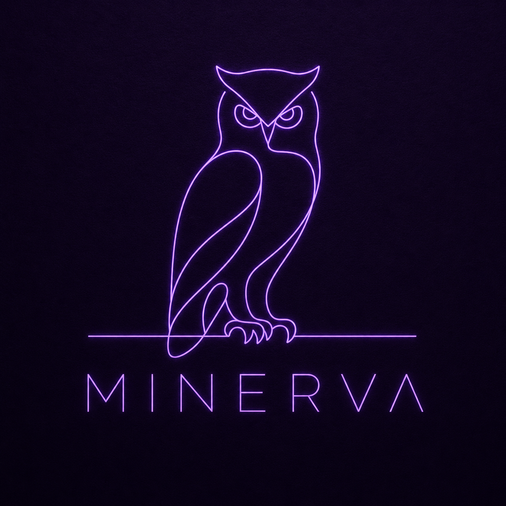

  

  <h1>Minerva</h1>
  
<i>"In the silence of the night forest, the owl sees everything."</i>

  
Intelligent HRM & Financial Management Platform

   

  
  
  
  

---

## The Owl's Vision

Every organization hides its truth in darkness — payslips buried in spreadsheets, absence records scattered across inboxes, financial anomalies invisible until it's too late. That is the night forest: dense, tangled, and silent.

Minerva is the owl that lives there.

**It sees through the fog.** Mountains of raw HR data — attendance logs, leave requests, overtime records — are chaos on their own. Minerva transforms that chaos into financial clarity, tracing every cost back to its origin.

**It hunts with precision.** When a CEO asks why the Design department is running at a loss, Minerva doesn't offer a summary. It follows the thread — from total cost, to headcount, to individual payroll lines — until the answer is found.

**It never sleeps.** While the organization rests, Minerva watches. Its dashboard runs 24 hours a day, giving leadership a live, uninterrupted view of the organization's financial health.

Every payslip in Minerva is a financial transaction. Every absence is a cost. The bridge between your people and your numbers is no longer a spreadsheet — it is a system that thinks.

---

## About the Project

**Minerva** unifies Human Resources and Finance into a single, automated platform. It replaces manual workflows with a fully auditable system — from attendance tracking to monthly payroll calculation — and surfaces the intelligence executives need to make decisions in real time.

### Key Features

| Feature | Description |
|---|---|
| **Executive Dashboard** | Real-time organizational health, updated live, always on |
| **Role-Based Access Control** | Scoped panels for CEO, Finance Manager, HR Manager, and Employees |
| **Payroll Engine** | Automatic calculation of deductions, insurance, tax, and overtime with full audit trail |
| **Drill-Down Analytics** | Trace any financial discrepancy to its source — department, team, or line item |

---

## Repository Structure

* **minerva/**
  * **backend/** : Django REST Framework — business logic and API layer
  * **frontend/** : React — client application
  * **docs/** : Architecture diagrams, UML, and use-case documentation
  * **README.md**
---
## System Interface & Capabilities

Minerva's interface is built on the principles of Glassmorphism and dark-mode elegance, prioritizing focus, speed, and data clarity.

### 1. Executive Command Center
The live dashboard providing leadership with an instant overview of workforce presence, pending approvals, and key operational metrics.

  

 

### 2. Employee 360° Analytics
A complete drill-down into an individual's organizational footprint. It tracks 7-day attendance trends, visualizes leave balances via donut charts, and securely manages financial contract details (with privacy blur toggles).

  

 

### 3. Dynamic Organization Chart
A fluid, interactive visualization of the company's hierarchy and departmental clustering, featuring real-time presence indicators (Present/Absent).

  

 

### 4. Centralized Payroll Management
The core financial engine. This portal allows Finance Managers to audit net salaries, review draft payslips, and execute payments seamlessly across all departments.

  

 

### 5. Employee Self-Service (Payslips)
A clean, accessible grid where employees can review their payment history and download cryptographically secure PDF payslips instantly.

  

 

### 6. System Administration & Database Control (Django Core)
Minerva is powered by a robust, fully customized Django admin interface (utilizing the Jazzmin theme to match our dark-mode aesthetic). It provides system administrators and core HR staff with direct, secure control over the database.

**Core Infrastructure Dashboard:** 
A bird's-eye view of the entire database architecture, from Payroll configurations to OTP verifications.

  

 

**Advanced Record Management:** 
Customized list views with tailored filtering, search capabilities, and avatar integrations, allowing Data Administrators to manage the workforce with zero friction.

  

## Team

| Name | Role | GitHub |
|---|---|---|
| Shahin Zamani | Project Director & Strategic Lead | [@shahinzam101](https://github.com/shahinzam101) |
| Seyed Mohammad Anbari | Core Logic Engineer & Backend Architect | [@mmd-anbari](https://github.com/mmd-anbari) |
| Alireza Sheikhahmadi | UI/UX Architect & Lead Frontend Engineer | [@Alirezasha1](https://github.com/Alirezasha1) |
| Sahar Pourjafar | Lead Integration Engineer & API Architect | [@saharp51022-creator](https://github.com/saharp51022-creator) |
| Avisa Feizi | DevOps & Software Quality Engineer (QA) | [@Avisaoops](https://github.com/Avisaoops) |
| Mahtab Saberi | Data Architect & System Administrator | [@Mh-Saberi](https://github.com/Mh-Saberi) |
| Nima Bakhour | Technical Documentation Lead & Platform Administrator | [@NimaBakhour](https://github.com/NimaBakhour) |
---

  Minerva — 2026

---
